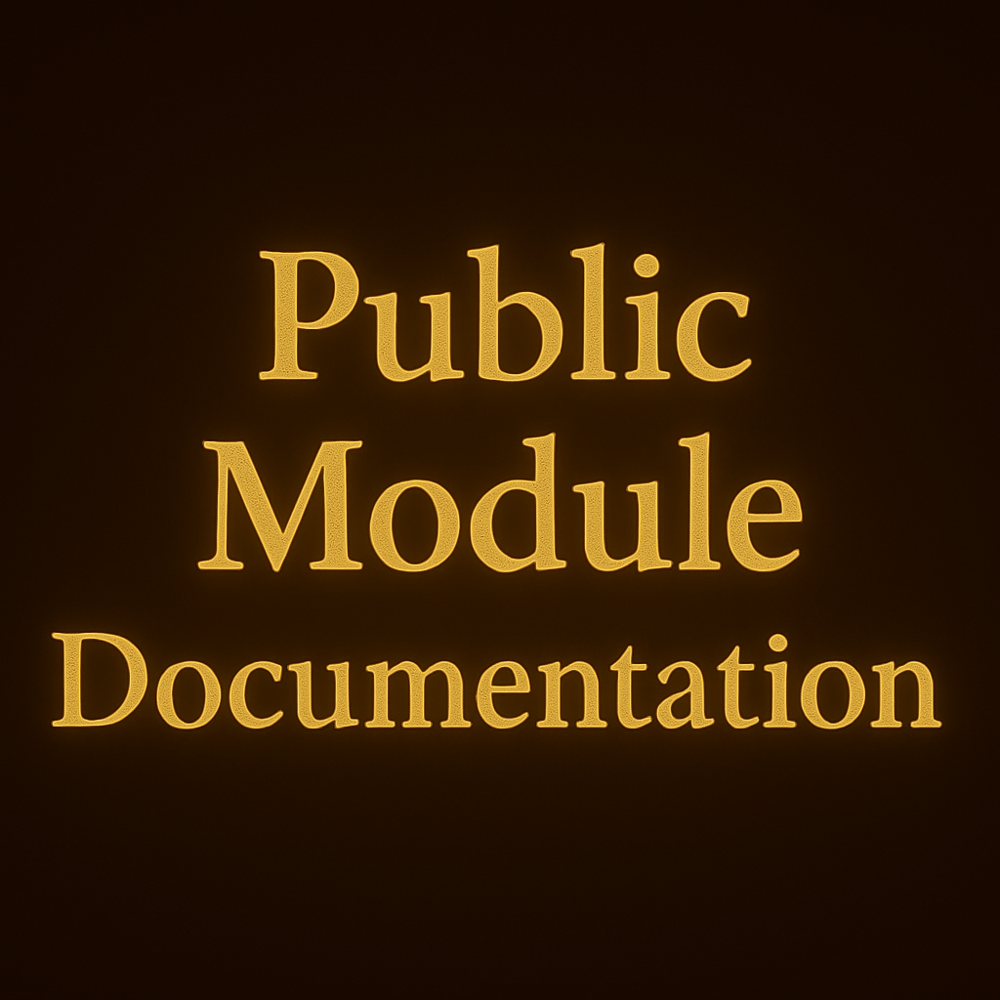

### Æ.O.N Public Module Documentation

*This area contains 5 of 20 linguistic modules that power the Æ.O.N framework.
These modules demonstrate the methodology and validation approach.*

**Full module access available to academics and linguists upon request for 
review purposes.**

**Contact:** aeonlinguistic.engine@gmail.com

**Modules included**:
- 01: System architecture and operating protocols
- 02: Simulation modes and analytical approaches
- 03: Core analytical cycle engine rules
- 04: Phoneme change pattern analysis (example methodology)
- 19: Field linguist validation checklist

*Additional modules (08, 12-18, 20) contain proprietary implementation 
details, curated datasets, and culturally sensitive frameworks.*
