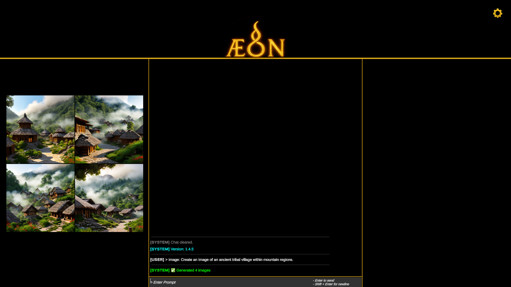

# Æ.O.N: The Analytical Engine of Origin and Narrative
**Linguistic Simulation Engine • Unity 6 • AI-Integrated Platform**  

**ÆON is a hybrid linguistic simulation environment combining academic-grade language evolution modeling, creative worldbuilding tools, and a fully integrated offline AI ecosystem.**  
This repository serves as a **showcase, documentation hub, and branding archive** for AEON.  
The full application is available on itch.io → [Æ.O.N: The Analytical Engine of Origin and Narrative](https://malloway.itch.io/aeon)

---

## 🎬 Quick Preview

*A glimpse of ÆON’s interface.*

---

## 🧭 What is ÆON?
ÆON is a **linguistic simulation and reconstruction engine** designed to model how languages evolve, fracture, and preserve memory across generations in both **real historical contexts** and **speculative futures**.

It blends:

- **Professional software engineering** (Unity 6, Python, KoboldCPP, Stable Diffusion, Piper tts)
- **Academic linguistic methodology** (sound change, grammar drift, proto-form reconstruction)
- **Speculative simulation** (Martian English, feline semiotic drift, ritual fossilization)

ÆON functions as:

- A **research tool**  
- A **creative worldbuilding platform**  
- A **cultural preservation aid**  
- A **forward-linguistics simulation environment**  

---

## ⚙️ Architecture Overview
ÆON uses a modular engine governed by a **Symbolic Router** that dynamically activates relevant subsystems based on user input.

### 🧩 Core Linguistic Modules
| Module | Purpose |
|--------|----------|
| **Phoneme Drift Engine** | Simulates attested cross-linguistic sound changes over generational timelines. |
| **Morphology Chain Logic** | Models morphological erosion, fusion, affix drift, and analogical reformation. |
| **Syntax Evolution Ruleset** | Tracks grammar drift, word-order changes, clause collapse, and grammaticalization. |
| **Prosody & Tonal System** | Handles stress, meter, cadence, tonal evolution, and chant-aligned drift patterns. |
| **Ritual Fossilization Engine** | Preserves archaic forms in ceremonial, symbolic, or mnemonic speech domains. |
| **Artifact Influence Engine** | Evaluates how writing systems, media, and material culture stabilize or mutate language. |
| **Diaspora & Trauma Drift Engine** | Simulates crisis-accelerated divergence, displacement-driven simplification, and trauma-pressure drift. |
| **Root Fossil Reintegration** | Validates reconstructed proto-forms using typology, phonotactics, and preservation models. |
| **Historical Backtrace Mode** | Reverse-engineers modern fragments back into proto-forms or unattested ancestral stages. |
| **Corpus Coherence Engine** | Aligns simulated languages with real linguistic corpora and typological universals. |
| **Export & Ethnographic Format Engine** | Generates academic, narrative, or simplified outputs with glossing and metadata options. |
| **Taboo & Information Suppression Engine** | Models taboo domains, semantic voiding, euphemistic drift, and symbolic fossilization. |
| **Lost Word Backtrace Mode** | Reconstructs missing lexemes from partial fossils, symbols, or phonemic residues. |
| **Diaspora & Trauma Dialects Model** | Simulates dialect fragmentation, symbolic residue formation, and contact instability. |
| **Ethnographic / Academic Export Engine** | Structures outputs for research-grade exports, corpus logs, or simplified public formats. |
| **Root Fossil Reintegration Engine** | Performs post-simulation proto-form validation using CRI/MV/SC metrics. |
| **Real-Time Corpus Integration Engine** | Performs API-level corpus checks and matches simulated roots to attested data. |
| **Generic Corpus Validation Framework** | Applies cross-linguistic corpus scans and typological benchmarks for plausibility. |
| **Field Linguist Validation Checkliste** | Provides a field-linguist-style validation pass: phonemic, semantic, syntactic, prosodic checks. |
| **Corpus Match Seed Set** | Provides pre-mapped proto-root → corpus-attested cognate anchors for reconstruction grounding. |

All 20 modules are fully integrated into ÆON’s runtime environment.

---

## 🧠 AI Integration
ÆON incorporates **both offline and online AI systems**:

- **Local LLM Backend** (KoboldCPP, `.gguf`)  
- **Stable Diffusion Backend** (local Python environment)
- **Text To Speech** System or Piper for tts audio narration
- **Cloud AI Fallback** (OpenRouter and compatible endpoints)  
- **Automatic Module Routing** using tag-based context detection  
- **Thread-Safe Subprocess Manager** for all AI tasks  

ÆON includes a complete offline stack so users can run everything **without internet access**.

---

## 🎨 Interface & Experience
- **Golden seal branding + professional splash screen**  
- **Interactive chat environment with multi-line input**  
- **Cross-platform support** (Windows release; macOS/Linux theoretical)  
- **Automatic archiving system** for logs, images, and exports  

Directory example:
<pre>
Documents/AEON Logs/{yyyyMMdd}/
├── logs/
├── images/
└── debug/
</pre>

---

## 📚 AEON Showcases (Academic + Speculative Studies)
ÆON includes a curated library of **linguistic case studies** demonstrating real and imagined evolution:

**[AEON Showcases](AEON-Showcases)**

---

## 💵 Pricing Model
ÆON follows an ethical, value-based model intended to balance accessibility and sustainability:

### 🟢 Æ.O.N. Complete: $30 (One-Time)
Full application access, all modules, all AI integrations, lifetime updates.

### 🟤 Indigenous & Tribal Access: Free
Full access for heritage preservation and revitalization projects.

Get the full application:  
[Æ.O.N: The Analytical Engine of Origin and Narrative](https://malloway.itch.io/aeon)

---

## 🌍 Core Values
- **Cultural Preservation:** Language recovery tools accessible without gatekeeping.  
- **Academic Integrity:** Transparent processes, reproducible simulations.  
- **Creative Freedom:** Support for fictional, extraterrestrial, and speculative linguistics.  
- **Ethical AI:** Offline-first architecture respecting privacy and sovereignty.  
- **Technical Stewardship:** Core systems are protected to maintain integrity.

---

## 📦 Launch Status
| Component | Status |
|-----------|--------|
| Unity Build | ✅ Complete |
| Local AI Integration | ✅ Tested |
| SD Integration | ✅ Verified |
| Multi-Platform Packaging | ⚠️ Windows primary; others theoretical |
| Itch.io Release | ✅ Live |
| Documentation | 🟡 Expanding |
| Showcases | 🟢 Active |

---

## 🎨 Visual Identity
Branding assets can be found under **`/AEON-Branding/`**:
- `Name_v2.png` - Primary logotype  
- `V5.png` - Golden seal emblem  
- `LoadingScreen.png` - Official splash artwork  

These are used across documentation, trailers, and external presentations.

---

## ⚖️ Licensing
© 2025 **Devin Barrett** - All Rights Reserved.

This repository contains *documentation, showcases, and branding assets*.  
The AEON application itself is proprietary software and may not be redistributed, modified, or reverse-engineered.

For cultural licensing, academic partnerships, or support:
**Email:** aeonlinguistic.engine@gmail.com

---

## 🪶 Author
**Devin Barrett**  
Developer • Linguistic Systems Designer • AI Integration Engineer  
Creator of the Æ.O.N. project  
> *“Built to Remember.”*

---

## 🔗 Useful Links
- **Æ.O.N. on itch.io:** [Æ.O.N. - The Analytical Engine of Origin and Narrative](https://malloway.itch.io/aeon)
- **Showcases:** [AEON Showcases](AEON-Showcases)
- **Official Discord Channel:** [AEON Linguistic Engine](https://discord.gg/vCQEyC8CWm)
- **Official Youtube Channel:** [Æ.O.N Engine](https://www.youtube.com/@OfficialAeonEngine)
