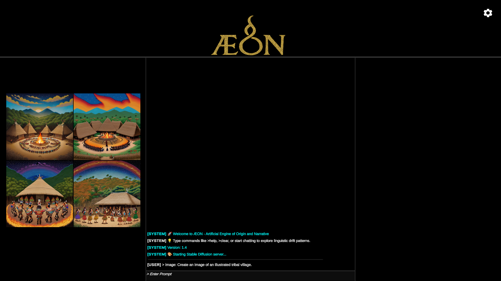

# ÆON — Analytical Engine for Origin and Narrative
**Linguistic Simulation Engine • Unity 6 • AI-Integrated Platform**  
© 2025 Devin Barrett - All Rights Reserved  
> *“Built to Remember.”*  

**ÆON is a hybrid linguistic simulation environment combining academic-grade language evolution modeling, creative worldbuilding tools, and a fully integrated offline AI ecosystem.**  
This repository serves as a **showcase, documentation hub, and branding archive** for AEON.  
The full application is available on itch.io → [Æ.O.N. - The Analytical Engine of Origin and Narrative](https://malloway.itch.io/aeon)

---

## 🎬 Quick Preview

*A glimpse of ÆON’s simulation interface and symbolic routing engine.*

Explore full case studies and output examples in:  
👉 **[AEON Showcases](AEON-Showcases)**

---

## 🧭 What is ÆON?
ÆON is a **linguistic simulation and reconstruction engine** designed to model how languages evolve, fracture, and preserve memory across generations in both **real historical contexts** and **speculative futures**.

It blends:

- **Professional software engineering** (Unity 6, Python, KoboldCPP, Stable Diffusion)
- **Academic linguistic methodology** (sound change, grammar drift, proto-form reconstruction)
- **Speculative simulation** (Martian English, feline semiotic drift, ritual fossilization)

ÆON functions as:

- A **research tool**  
- A **creative worldbuilding platform**  
- A **cultural preservation aid**  
- A **forward-linguistics simulation environment**  

---

## ⚙️ Architecture Overview
ÆON uses a modular engine governed by a **Symbolic Router** that dynamically activates relevant subsystems based on user input.

### 🧩 Core Linguistic Modules
| Module | Purpose |
|--------|----------|
| **Phoneme Drift Engine** | Simulates attested cross-linguistic sound changes over generational timelines. |
| **Morphology Chain Logic** | Models morphological erosion, fusion, and analogical reformation. |
| **Syntax Evolution Ruleset** | Tracks grammar drift, word-order changes, and grammaticalization patterns. |
| **Prosody & Tonal System** | Handles stress, meter, and tonal evolution across dialect splits. |
| **Ritual Fossilization Engine** | Preserves archaic forms in ceremonial and mnemonic speech domains. |
| **Artifact Influence Engine** | Evaluates how writing systems and material culture stabilize language. |
| **Diaspora & Trauma Drift Engine** | Simulates crisis-accelerated divergence and dialect fragmentation. |
| **Root Fossil Reintegration** | Validates reconstructed proto-forms against typological plausibility. |
| **Historical Backtrace Mode** | Reverse-engineers modern fragments to proto-forms using comparative method. |
| **Corpus Coherence Engine** | Aligns generated languages with established linguistic databases. |

All 17 modules are fully integrated into ÆON’s runtime environment.

---

## 🧠 AI Integration
ÆON incorporates **both offline and online AI systems**:

- **Local LLM Backend** (KoboldCPP, `.gguf`)  
- **Stable Diffusion Backend** (local Python environment)  
- **Cloud AI Fallback** (OpenRouter and compatible endpoints)  
- **Automatic Module Routing** using tag-based context detection  
- **Thread-Safe Subprocess Manager** for all AI tasks  

ÆON includes a complete offline stack so users can run everything **without internet access**.

---

## 🎨 Interface & Experience
- **Golden seal branding + professional splash screen**  
- **Interactive chat environment with multi-line input**  
- **Cross-platform support** (Windows release; macOS/Linux theoretical)  
- **Automatic archiving system** for logs, images, and exports  

Directory example:
<pre>
Documents/AEON Logs/{yyyyMMdd}/
├── logs/
├── images/
└── debug/
</pre>

---

## 📚 AEON Showcases (Academic + Speculative Studies)
AEON includes a curated library of **linguistic case studies** demonstrating real and imagined evolution:

### 🧬 Academic / Historical
- **Beringian Lineage Recovery**: Reconstruction of a fragmented Alaskan-Yupik cluster.  
- **Gaelic Diaspora Backtrace**: Reverse-time reconstruction of diaspora dialects.  
- **Proto-Indo-European Root Study**: Comparative simulation across 10 daughter branches.  
- **Dene–Yeniseian Reintegration Test**: Evaluating cross-continental cognate plausibility.

### 🚀 Speculative / Forward-Linguistic
- **Martian Dialect Evolution (2025–2175)**: Trajectory of “Soltok,” a Martian-English offshoot.  
- **Felis domesticus Semiotic Drift (2025–3000)**: Cross-species semiotic expansion toward a feline–human pidgin.  
- **Ritual Backtrace Simulation**: Fossilized ceremonial syntax under extreme time depth.

Each showcase contains:
- Module breakdown  
- Time-depth modeling  
- Generated examples  
- Export-ready reports  

---

## 💵 Pricing Model
ÆON follows an ethical, value-based model intended to balance accessibility and sustainability:

### 🟢 AEON Complete — $30 (One-Time)
Full application access, all modules, all AI integrations, lifetime updates.

### 🏛 Institutional Support — $10/seat/month
Academic licensing for universities, museums, and research institutions.

### 🟤 Indigenous & Tribal Access — Free
Full access for heritage preservation and revitalization projects.

Get the full application:  
👉 [Æ.O.N. - The Analytical Engine of Origin and Narrative](https://malloway.itch.io/aeon)

---

## 🌍 Core Values
- **Cultural Preservation:** Language recovery tools accessible without gatekeeping.  
- **Academic Integrity:** Transparent processes, reproducible simulations.  
- **Creative Freedom:** Support for fictional, extraterrestrial, and speculative linguistics.  
- **Ethical AI:** Offline-first architecture respecting privacy and sovereignty.  
- **Technical Stewardship:** Core systems are protected to maintain integrity.

---

## 📦 Launch Status
| Component | Status |
|-----------|--------|
| Unity Build | ✅ Complete |
| Local AI Integration | ✅ Tested |
| SD Integration | ✅ Verified |
| Multi-Platform Packaging | ⚠️ Windows primary; others theoretical |
| Itch.io Release | ✅ Live |
| Documentation | 🟡 Expanding |
| Showcases | 🟢 Active |

---

## 🎨 Visual Identity
Branding assets can be found under **`/AEON-Branding/`**:
- `Name_v2.png` — Primary logotype  
- `V5.png` — Golden seal emblem  
- `LoadingScreen.png` — Official splash artwork  

These are used across documentation, trailers, and external presentations.

---

## ⚖️ Licensing
© 2025 **Devin Barrett** - All Rights Reserved.

This repository contains *documentation, showcases, and branding assets*.  
The AEON application itself is proprietary software and may not be redistributed, modified, or reverse-engineered.

For cultural licensing, academic partnerships, or support:
📧 **aeonlinguistic.engine@gmail.com**

---

## 🪶 Author
**Devin Barrett**  
Developer • Linguistic Systems Designer • AI Integration Engineer  
Creator of the ÆON project  
> *“Built to Remember.”*

---

## 🔗 Useful Links
- **AEON on itch.io**: [Æ.O.N. - The Analytical Engine of Origin and Narrative](https://malloway.itch.io/aeon)
- **Showcases**: [AEON Showcases](AEON-Showcases)
- **Branding Assets**: ./AEON-Branding/  
- **Technical Recap**: ./AEON_TechnicalRecap.md  
- Official Site — *(in development)*
